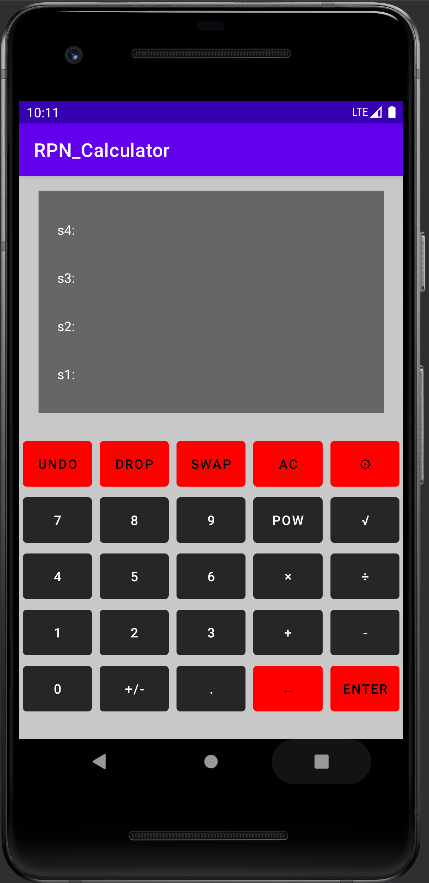
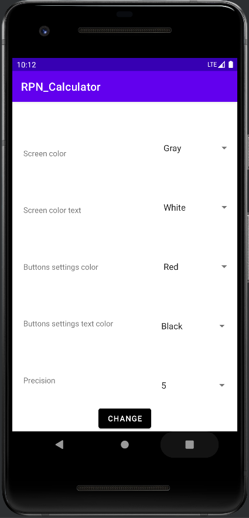

# RPN Calculator
 
Aplikacja została wykonana na urządzenia mobilne, przy użycia języka Kotlin. Niektóre struktury zostały zapożyczone z języka Java. Aplikacja jest kalkulatorem w odwrotnej notacji polskiej (ang. reverse polish notation). Logika RPN polega na wprowadzaniu na stos najpierw argumentów działań, a potem dopiero samych działań. Przykładowo chcąc dodać do siebie liczby 2 i 5 wprowadzamy na stos 2, następnie 5 a na końcu operator dodawania. Można w ten sposób wykonać dowolne działanie matematyczne. Kalkulator nie posiada znaku równości standardowo kończącego równanie. Zamiast tego po naciśnięciu odpowiedniego przycisku działanie wykonuje się automatycznie.

    
    

## Funkcjonalności
Zaimplementowany kalkulator pozwala na podsatwowe działania matematyczne, takie jak dodawanie, odejmowanie, mnożenie, dzielenie, potęgowanie, oraz pierwiazdkowanie. Dodatkowo zaimplementowane zostały dodatkowe opcje raczej niespotykane w tradycyjnych kalkulatorach. 

* `UNDO` - Pozwala na cofnięcie operacji.
* `DROP` - Usuwa element ze szczytu stosu.
* `SWAP` - Pozwala na zamianę kolejności dwóch pierwszych elementów stosu.
* `AC` - Standardowa operacja czyszczenia stosu.
* `Opcje` - Umożliwiają zmienę koloru teksu oraz tła przycisków funkcjonalnych, oraz ekranu. Dodatkowo można ustawić tam precyzję wyświetlanych liczb (domyślnie 5 liczb po przecinku).

 
<i>Dodatkowo</i>

* Po wciśnięciu klawisza `ENTER` w momencie gdy ekran jest pusty - na stosie zostanie powielona wartość z jego szczytu.
* Przycisk `+/-` pozwala na zmianę znaku wpisywanej liczby, jednakże gdy takowej nie ma zmieniany zostaje znak liczby ze szczytu stosu.
* Operację `UNDO` można wywołać po przesunięciu palcem po ekranie.